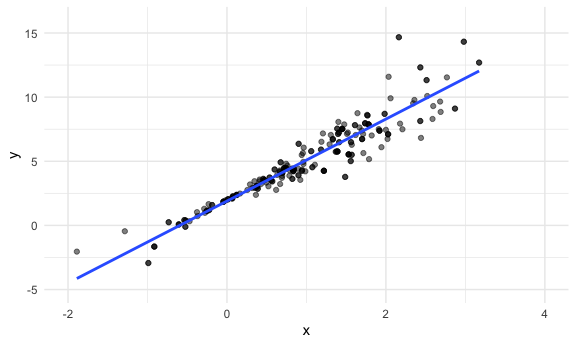
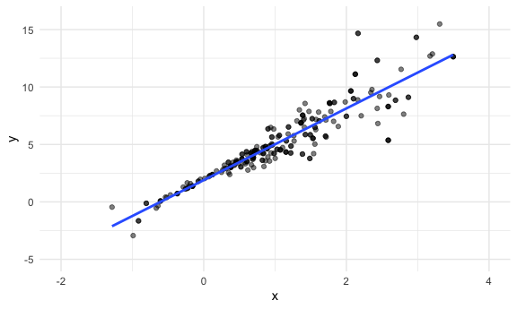
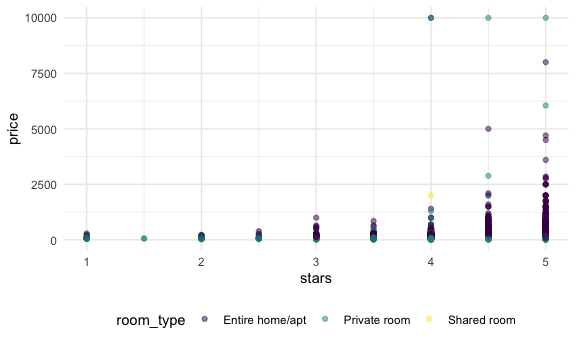
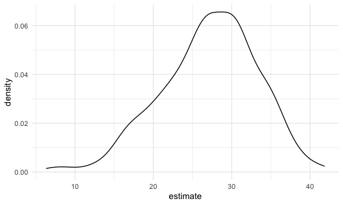

bootstrapping
================
Nicole Criscuolo
2025-11-13

Simulate 2 datsets.

``` r
set.seed(1)

n_samp = 250

sim_df_const =
  tibble(x = rnorm(n_samp, 1, 1),
         error = rnorm(n_samp, 0, 1),
         y = 2 + 3 * x + error)

sim_df_nonconst =
  sim_df_const |> 
  mutate(
    error = .75 * error * x,
    y = 2 + 3 *x + error
  )
```

Look at these data.

``` r
sim_df_const |> 
  ggplot(aes(x = x, y = y)) +
  geom_point()
```


``` r
sim_df_nonconst |> 
  ggplot(aes(x = x, y = y)) +
  geom_point()
```


What does `lm` do for these?

``` r
sim_df_const |> 
  lm(y ~ x, data = _) |> 
  broom::tidy() |> 
  knitr::kable(digits = 3)
```

| term        | estimate | std.error | statistic | p.value |
|:------------|---------:|----------:|----------:|--------:|
| (Intercept) |    1.977 |     0.098 |    20.157 |       0 |
| x           |    3.045 |     0.070 |    43.537 |       0 |

``` r
sim_df_nonconst |> 
  lm(y ~ x, data = _) |> 
  broom::tidy() |> 
  knitr::kable(digits = 3)
```

| term        | estimate | std.error | statistic | p.value |
|:------------|---------:|----------:|----------:|--------:|
| (Intercept) |    1.934 |     0.105 |    18.456 |       0 |
| x           |    3.112 |     0.075 |    41.661 |       0 |

Write a function to draw a bootstrap sample.

``` r
boot_sample = function(df) {
  
  sample_frac(df, size = 1, replace = TRUE)
  
}
```

Does this work?

``` r
sim_df_nonconst |> 
  boot_sample() |> 
  ggplot(aes(x = x, y = y)) +
  geom_point(alpha = .5) +
  geom_smooth(method = "lm", se = FALSE) +
  xlim(c(-2, 4)) +
  ylim(c(-5, 16))
```

    ## `geom_smooth()` using formula = 'y ~ x'



Formalize this a bit and extract results.

``` r
boot_straps =
  tibble(
    iter = 1:5000
  ) |> 
  mutate(bootstrap_sample = map(iter, \(i) boot_sample(df = sim_df_nonconst)))
```

(quick check)

``` r
boot_straps |> 
  pull(bootstrap_sample) |> 
  nth(2) |> 
  ggplot(aes(x = x, y = y)) +
  geom_point(alpha = .5) +
  geom_smooth(method = "lm", se = FALSE) +
  xlim(c(-2, 4)) +
  ylim(c(-5, 16))
```

    ## `geom_smooth()` using formula = 'y ~ x'



Actually run analyses.

``` r
bootstrap_results =
  boot_straps |> 
  mutate(
    fits = map(bootstrap_sample, \(df) lm(y ~ x, data = df)),
    results = map(fits, broom::tidy)
  )
```

Look at results

``` r
bootstrap_results |> 
  select(iter, results) |> 
  unnest(results) |> 
  group_by(term) |> 
  summarize(
    mean = mean(estimate),
    se = sd(estimate)
  )
```

    ## # A tibble: 2 × 3
    ##   term         mean     se
    ##   <chr>       <dbl>  <dbl>
    ## 1 (Intercept)  1.93 0.0762
    ## 2 x            3.11 0.103

Look at these first.

``` r
bootstrap_results |> 
  select(iter, results) |> 
  unnest(results) |>
  filter(term == "x") |> 
  ggplot(aes(x = estimate)) +
  geom_density()
```


``` r
bootstrap_results |> 
  select(iter, results) |> 
  unnest(results) |> 
  group_by(term) |> 
  summarize(
    ci_lower = quantile(estimate, .025),
    ci_higher = quantile(estimate, .975)
  )
```

    ## # A tibble: 2 × 3
    ##   term        ci_lower ci_higher
    ##   <chr>          <dbl>     <dbl>
    ## 1 (Intercept)     1.78      2.09
    ## 2 x               2.91      3.32

Do it again but faster this time.

``` r
bootstrap_results = 
sim_df_const |> 
  bootstrap(n = 10) |> 
  mutate(
    df = map(strap, as_tibble),
    fits = map(df, \(df) lm(y ~ x, data = df)),
    results = map(fits, broom::tidy)
    ) |> 
  select(.id, results) |> 
  unnest(results)
```

``` r
bootstrap_results |> 
  group_by(term) |> 
  summarize(
    mean = mean(estimate),
    se = sd(estimate)
  )
```

    ## # A tibble: 2 × 3
    ##   term         mean     se
    ##   <chr>       <dbl>  <dbl>
    ## 1 (Intercept)  2.00 0.124 
    ## 2 x            3.01 0.0775

## Airbnb

``` r
data("nyc_airbnb")
```

``` r
nyc_airbnb =
  nyc_airbnb |> 
  mutate(stars = review_scores_location / 2) |> 
  rename(
    borough = neighbourhood_group
  ) |> 
  filter(borough != "Staten Island") |> 
  drop_na(price, stars, room_type) |> 
  select(price, stars, room_type, borough)
```

``` r
nyc_airbnb |> 
  ggplot(aes(x = stars, y = price, color = room_type)) +
  geom_point(alpha = .5)
```



Try to do bootstrap.

``` r
airbnb_bootstrap_results =
  nyc_airbnb |> 
  filter(borough == "Manhattan") |> 
  bootstrap(n = 500) |> 
  mutate(
    df = map(strap, as_tibble),
    fits = map(df, \(df) lm(price ~ stars + room_type, data = df)),
    results = map(fits, broom::tidy)
  ) |> select(.id, results) |> 
  unnest(results)
```

Look at distribution of slope for stars.

``` r
airbnb_bootstrap_results |> 
  filter(term == "stars") |> 
  ggplot(aes(x = estimate)) +
  geom_density()
```


